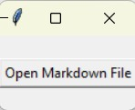

## Give It To Me Now

The binary is called MDpng2MDwebp.exe and is in the dist folder.  Click on the dist folder so you can see the .exe file.  If you click on it, you will get a screen where you can download the file by hitting the download arrow on the right hand side.  

## Details
This is a quick and dirty utility to convert docling .md files that have png.b64 streams into webp.b64 strings.  This will make the file much smaller.  You can use this for for Obsidian and should work on other .md files.  Because I'll most likely never touch this again, the executable is attached, and will not be put on a release.  If you download the binary, it should be completely self contained, and has no ability to change the config or the parameters.

If you run the program, it will present you with a dialog box.  You use the GUI file selector to find a file that has .png embedded images in it.  This is sterotypical of docling .md files.

The dialog box looks like the picture below.  The program is slow to run at first because it is compiled python, but once loaded, it is very quick to process a file.

