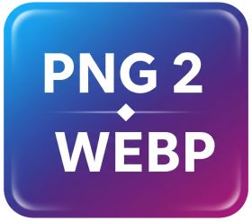
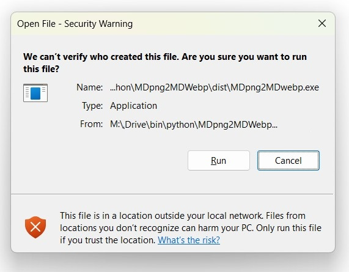

## Give It To Me Now

The binary is called MDpng2MDwebp.exe and is in the dist folder.  Click on the dist folder so you can see the .exe file.  If you click on it, you will get a screen where you can download the "raw" file by hitting the download arrow on the right hand side.  

I have not signed the .exe, so Windows or Windows Defender will complain the first time you run the program, and you'll need to hit the appropriate info box to get the option to run the program anyway.

The initial launch of the program is very slow.

## Details

Why do you want this program?  If you have a Docling .md file or if you have any embedded b64 .png in an .md file, this will convert the image to webp, saving a tremendous amount of storage.  You may be able to compress a PDF to be smaller than the original file, while keeping all the data you need for use or for you LLM.

This is a quick and dirty utility to convert docling .md files that have png.b64 streams into webp.b64 strings.  This will make the file much smaller.  

In my testing by re-encoding the PNG stream with a variable sized webp stream at 20%, you can save up to 80% space. However, validate if graphics are good enough after processing.

You can use this for for Obsidian and should work on other .md files.  Because I'll most likely never touch this again, the executable is attached, and will not be put on a release.  If you download the binary, it should be completely self contained, and has no ability to change the config or the parameters.

If you run the program, it will present you with a dialog box, which is small and may not be focused. A picture of this box is below.  You will need to hit "Open Markdown File" to activate a GUI file selector.  You use the GUI file selector to find a file that has .png embedded images in it.

The program is slow to load at first because it is compiled python, but once loaded, it is very quick to process a file.

I currently haven't purchased a cert, so you will see this when you run the program.  If this is uncomfortable for you, then I would suggest running the python script, which will involve making sure you have all the dependancies loaded.

The program create a smaller version of the original file in the same directory and adds a _Webp to the end of the file name for identification.

## Savings

My current process flow is to create markdown files with docling, which creates embedded png files
After this file is created, you can run MDpng2MDwebp on the newly created file and it will convert the images

Savings is highly dependent on the original file and content, but here are two examples:

|                                 | Original PDF | Docling .md | MDpng2MDwebp | Savings from PDF (%) |
| ------------------------------- | ------------ | ----------- | ------------ | -------------------- |
| **Owners Manual**               | 1,513 KB     | 207 KB      | 29 KB        | 98.08%               |
| **Business Report with Graphs** | 1,172 KB     | 1,548 KB    | 353 KB       | 69.87%               |

